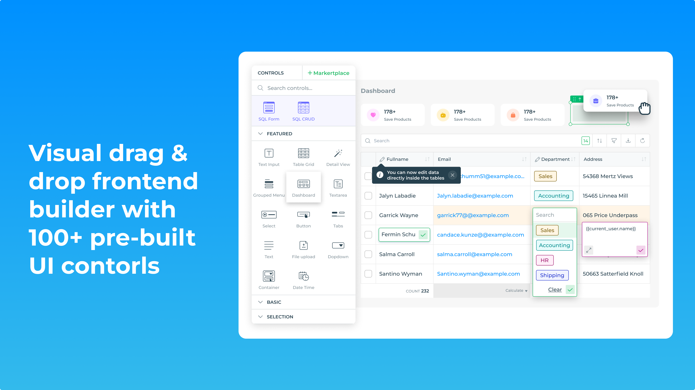
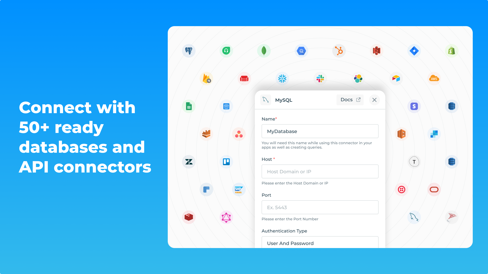

<h1 align="center">
  DronaHQ
</h1>

DronaHQ is a developer toolset to build internal tools, custom portals, and digital journeys at 10X speed. Offering pre-built UI components(Table grid, button, text input, advanced dropdowns, charts, etc.), ready connectors(MySQL, MongoDB, PostgreSQL & more) action & automation blocks for visual development of web & mobile applications. Heavy-lifting the app development & deployment tasks with user management, SSO, security, environments, version history, audit logs, and analytics.

  

  

  

## Features

### Visual Application Development: 
Create custom applications through a user-friendly, visual interface.
  

### Drag-and-Drop Interface: 
Build apps by dragging and dropping components onto the design canvas.
  

### Template Library: 
Access pre-built templates and components for rapid app development.
  

### Integration: 
Seamlessly connect to various data sources, APIs, and third-party services.
  

### Workflow Automation: 
Design and automate business processes and workflows.
  

### Mobile App Development: 
Develop cross-platform mobile applications for iOS and Android.
  

### Version Control: 
Manage different versions of applications and track changes effectively.
  

### Self-Hosted Deployment: 
Deploy DronaHQ on your organization's own servers for full control over the hosting environment.
  

### Custom JavaScript (JS) Code: 
Extend functionality with custom JavaScript code to meet specific requirements.
  

### Role-Based Access Control: 
Define access permissions based on user roles.
  
